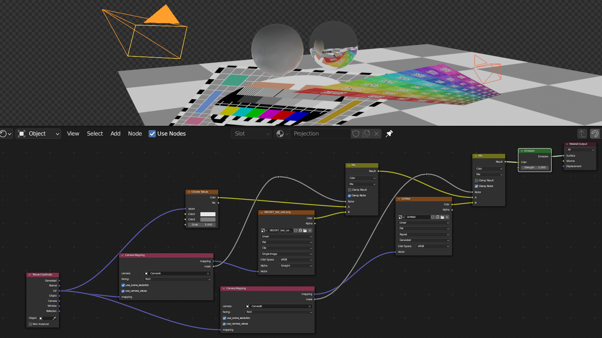

# CameraMappingMaterialNode

Supports eevee and cycles.

---
## Why?
---

The usual method of adding a UV Project modifier has a couple of drawbacks.

1. The modifier has to be attached to any object that needs a projection.
2. The resultant mapping is dependent on the resolution of the geometry. For example, if the geometry is low poly, distortions in the projected image will be seen.

This addon solves both issues by being material based. No modifier needed and geometry can be just one triangle if needed. Mixing projections from different cameras also becomes a lot more intuitive.

### Why not just use the `Camera` or `Window` outputs on the texture coordinate node?

These are view based and cannot easily be previewed. The only way to look at the result is a render looking through the intended camera. This also prevents the mixing of projections from different cameras.

---
## Example
---

The corresponding *.blend file is in ./examples. It shows how to mix two camera projection mappings with a uv mapping using the node's mask output.

---
## Properties
---

### camera

The camera to use for the projection. This property is required.

### facing

Where the projection should land.

front - any polygon with a normal facing toward the specified camera
back - any polygon with a normal facing away from the specified camera
both - any polygon

If front or back is selected, the opposite face will use the mapping connected to the `mapping` input socket

### use scene resolution

If checked, use the resolution of the active scene to calculate projection. Otherwise, input values are used.

### use camera values

If checked, use the focal length and sensor width of the specified camera to calculate projection. Otherwise, input values are used.

---
## Sockets
---

### mapping

input - the mapping vector to pass through. 
output - the camera mapping vector

### mask

White for everything inside 0-1 of the camera mapping. Black outside. This can be used for mixing between other mappings.

